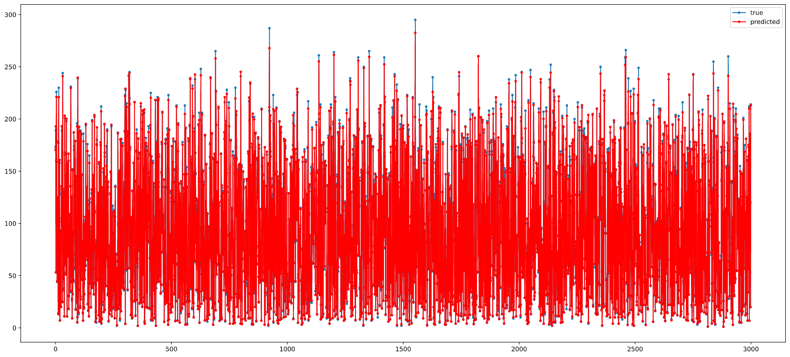

# Calories Burned Linear Regression
## A linear regression model to detect the amount of calories burned by someone while exercising.

A simple linear regression model on the data gave a r2 score of 0.9672. Upon using the random forest regressor the score increased to 0.9982. Using PCA as well reduces the score by a bit.  
 

    

   
Using a neural network increased the r2 score to 0.9997. A significant improvement.  
 

    

